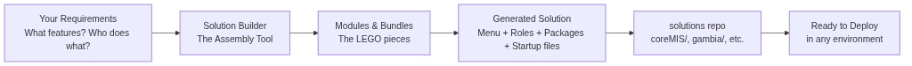

# The Challenge: One Size Does NOT Fit All

Different programs need different things:

| Program Type         | Special Needs                              |
|----------------------|--------------------------------------------|
| National Health Insurance | Claims processing, hospitals, pricing lists |
| Social Protection / Cash Transfers | Beneficiary registries, payroll, grievances |
| Formal Sector Schemes     | Contracts, contributions, invoices         |
| Pilot Projects            | Experimental features, lighter setup       |

**Building a completely new system for each use case is expensive and slow.**

---

# The Solution: "Solution Building"

Solution Builder is a **smart assembly tool** that lets teams create a custom version of openIMIS by choosing the features they need.

- No need to start from scratch
- No need to be a developer to configure
- One codebase, many tailored versions

It's like ordering a custom pizza or building with LEGO blocks instead of sculpting from clay.

---

# The Two Repos — Factory + Catalog

This presentation explains the **solution-builder** tool.

It works as a pair with the **`solutions`** repository:

| solution-builder                        | solutions repo                              |
|-----------------------------------------|---------------------------------------------|
| The **factory / kitchen**               | The **shelf of finished, ready-to-use meals** |
| Contains the modules + the assembly tool | Contains ready-made country configurations   |
| Used to *design and generate* a solution | Used to *deploy or adapt* a solution fast   |

You design here → clean output lands in the solutions repo.

---

# How It Works (The Simple Picture)

1. **Pick your building blocks** (called modules)
2. **Choose who should see and do what** (roles)
3. **Pick fixtures** that will seed data into you systems
4. **The tool puts everything together**
5. **You get a ready-to-use package**

The result is a complete, consistent "flavor" of openIMIS that can be deployed for a specific country or program.

---

# Visual: How Solution Building Works

---

# What Are "Modules"?

Modules are **self-contained features** you can turn on or off.

Examples:

- **Core** — Login, users, basic navigation
- **Claims** — Submit and review medical claims
- **Social Protection** — Benefit plans, beneficiaries, payroll
- **Grievance** — Register and resolve complaints
- **Individual Registry** — Modern person and group data
- **AI Claim Quality** — Automatically flag suspicious claims
- **Reports & Dashboards** — Powerful search and analytics

You mix and match the ones you need.

---

# Before vs After Solution Builder

**Before:**
- Not official way to describe a full solution
- Hard to track how much a custom a solution was
- Very hard to maintain 5 or 10 different versions
- No was to seed only the relevant metadata to the solution

**After:**
- One shared repository with prebuild solutions
- Countries are described by **configuration** (a shopping list of features)
- New features are added once and become available for everyone
- Deployments become much faster and more reliable

---

# Bundles Make It Even Easier

Some features naturally belong together.

Example: the **Social Protection Bundle** includes:
- Individual Registry
- Social Protection
- Payroll & Payment Cycles
- Grievance handling
- Deduplication tools

Instead of selecting 6 separate modules, you pick one bundle.

---

# Concrete Example: Building "coreMIS"

A popular configuration called **coreMIS** is built by combining:

- The core openIMIS system
- Social protection features + payroll
- Grievance / complaint handling
- Advanced reporting with OpenSearch
- contracts
- Special roles for different users (Local Admin, Accountant, Social Protection Manager...)

The Solution Builder reads a short "shopping list" and produces the complete package that ends up in the solutions repo under `coreMIS/`.

---

# What Does Solution Builder Actually Produce?

It assembles a complete ready-to-run solution:

- **Navigation menu** — exactly the screens and options users will see
- **User roles** — e.g. "Accountant", "Field Officer", "Local Admin" with the right access
- **Software ingredients list** — which features should be active
- **Startup instructions** — how all the pieces (database, web app, search, etc.) should start together
- **Initial settings** — languages, core configuration, and sample data

Everything is bundled so deployment teams can pick it up and go.

---

# Ready-Made Solutions (in the solutions repo)

The `solutions` repository contains pre-built configurations you can use today:

- **coreMIS** — Widely used full-featured base
- **SHI** — Social Health Insurance flavor
- **IBR** — Insurance-based registry variant
- **gambia** / **niger** — Country-specific setups
- **claim_ai** — Includes AI-assisted claim quality checks
- **sphf** — Strong focus on social protection

These are not just ideas — they are complete, working folders that deployment teams can use directly or customize further.

---

# A Typical Workflow

1. Program owners describe what they need
2. A configurator chooses the right modules or bundles
3. Solution Builder generates all the required files
4. The finished configuration is saved in the `solutions` repository
5. Country teams take that folder and launch their instance

Every version is tracked, reusable, and consistent across projects.

---

# Why This Matters (Benefits)

**For decision makers:**
- Faster time-to-deployment
- Lower cost (reuse instead of rebuild)
- Consistent quality across countries

**For implementers:**
- Clear building blocks instead of custom spaghetti code
- Easier to compare and maintain different country versions
- New features can be added once and offered to everyone

**For the community:**
- Knowledge and configuration are shared, not locked away

---

# Key Takeaway

> **Solution Builder turns "we need a system like X but with Y and Z"**  
> **into a reliable, repeatable, and fast process.**

It does not replace developers — it multiplies their impact by letting the same core platform serve many different realities.

---

# Additional Resources

- `solutions` repo → sibling folder `../solutions` (or https://github.com/openimis/solutions)
- This repo (`solution-builder`) → contains the tool and all the module definitions
- Full technical documentation is in the `README.md` of this repository

---

# Thank you again!

**The goal:** Make it easy to deliver the *right* version of openIMIS, faster, and more consistently — everywhere it is needed.

